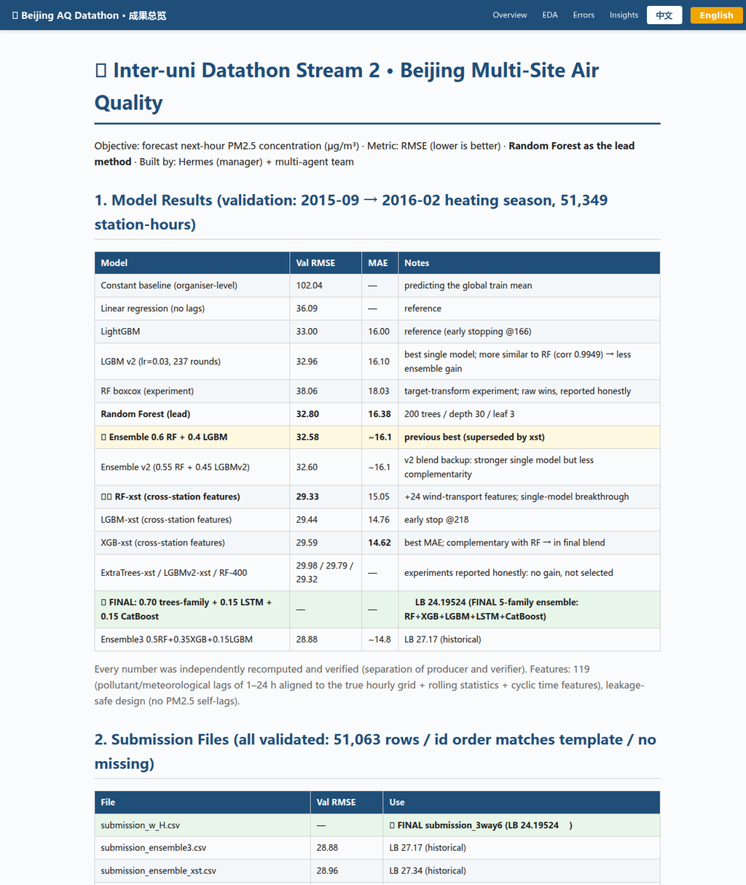

# Beijing Multi-Site Air Quality — Datathon Results

Results site for our **Inter-uni Datathon (Stream 2)** entry: next-hour PM2.5 forecasting across 12 Beijing stations. Metric: RMSE (lower is better). **Final leaderboard: 24.195** with a five-family ensemble.

**Live site:** https://12345666ddwa.github.io/beijing-aq-datathon/ (bilingual EN / 中文)
**Code repo:** [beijing-aq-datathon-code](https://github.com/12345666ddwa/beijing-aq-datathon-code)

## What's here

- Full **model ledger** with honest experiment notes — what improved, what didn't, and why (kept for reproducibility, not just the highlight reel).
- Three bilingual reports: **EDA**, **error analysis** (18.4% of rows — heavy-pollution hours — drive 80.3% of total error), and an **insights & public-health narrative**.
- All **submission files** with their validation scores.
- Key figures: station patterns, feature importance, error structure.

Team "Data PyRates" — inter-university datathon, 2026.
